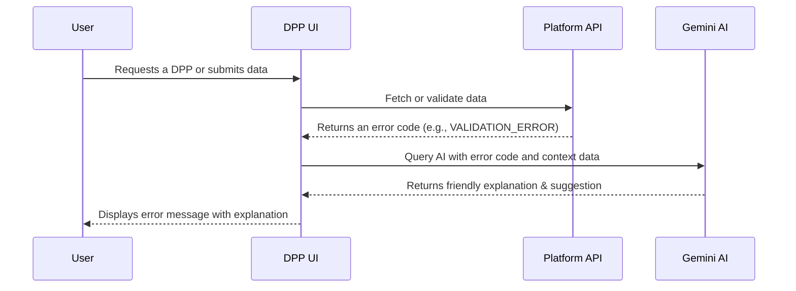

# DPP Methodology: UX Fallback States and Resilience

A critical aspect of the platform is its resilience in the face of incomplete or problematic data. The user experience (UX) has been designed to gracefully handle cases where a Digital Product Passport is partial, expired, or invalid. Instead of failing silently or showing technical errors, the UI (with help from Gemini AI) provides informative feedback and paths to resolution. Additionally, administrative users have tools to override or rollback changes when necessary, ensuring that business operations can continue smoothly even when issues arise.

## Handling Partial DPPs

Sometimes a passport may not have all the required information – perhaps a supplier hasn’t provided certain data, or a new regulation adds required fields that are not yet filled. The platform handles these partial DPPs by:

- **Visual Cues**: The UI will clearly mark missing information sections (e.g., highlighting empty required fields with a placeholder like “Data pending” or an icon). This allows viewers to know the passport is not complete.
- **Guidance Messages**: A banner or note at the top of the DPP might state: “This passport is currently incomplete. Some data is pending or in progress.” If the Gemini AI has context, it could add: e.g. “Awaiting supplier data on material composition” to pinpoint what’s missing.
- **Restricted Actions**: Certain actions (like publishing the DPP publicly or using it to satisfy a compliance check) may be disabled if the passport is flagged partial. The UI will inform the user why: “Passport cannot be published because it is missing required regulatory fields.”
- **Progress Tracking**: For users filling out a DPP, a progress bar or checklist can show completion status. E.g., 8/10 sections completed. This encourages finishing the data entry.
- **Fallback Data Use**: If partial data is acceptable (for example, a provisional passport for internal use), the system will still display what is available rather than blocking entirely. It errs on the side of showing partial info with warnings, rather than nothing.

## Expired or Invalid Passports

Digital Product Passports may have an expiration (for instance, if tied to a certification that expires, or simply to prompt periodic review). Additionally, a passport might be deemed invalid if data is corrupted or fails verification (like a digital signature mismatch). The UX in these cases:

- **Expiration Handling**: The system tracks expiry dates for passports (if applicable). An expired passport is labeled clearly (e.g., “Expired” badge). The UI might use a muted color scheme for expired passports. Users attempting to view an expired passport get a warning banner: “This product passport expired on YYYY-MM-DD and may contain out-of-date information.”
- **Invalid Data Warnings**: If a passport’s integrity check fails (say the QR code was tampered, or required validations fail), the UI shows an error state. For example, “Error: Passport data invalid or corrupted.” It will not display potentially misleading data; instead, it might show only certain safe fields or nothing beyond the error.
- **Gemini AI Explanations**: In both cases, the AI can provide a user-friendly explanation. For expiry: “The passport has passed its validity period, which could be due to an update requirement. Please contact the manufacturer for the latest information.” For invalid: “The passport data failed our verification checks (e.g., a checksum didn’t match). This could indicate it was altered or generated incorrectly.”
- **Preventing Use**: The system may prevent some interactions with invalid/expired passports, such as printing an official certificate or syncing to external systems, to ensure no one relies on an outdated or wrong passport.

The table below summarizes UI behavior for different problematic passport states:

| Scenario                         | UI Behavior                                                                                             | Example Outcome                                                                                                                                                             |
| -------------------------------- | ------------------------------------------------------------------------------------------------------- | --------------------------------------------------------------------------------------------------------------------------------------------------------------------------- |
| Partial Passport (Incomplete Data) | Show available data; highlight missing fields; banner indicating passport is incomplete. Possibly provide reason (e.g., “Waiting for supplier X’s data”). | User views passport: sees most fields, but “Material Origin: (pending data)” highlighted. A message at top explains some data is missing.                                    |
| Expired Passport                 | Display passport with “Expired” label; banner warning user; data is shown but marked as possibly outdated. | User scans product QR: passport opens with a red “Expired on 2025-12-31” notice. The details are visible but a warning advises to check for updates.                            |
| Invalid Passport                 | Do not show normal passport details; show error message and explanation; offer support contact or retry if possible. | User attempts to open passport: instead of product info, sees “Error: Passport data invalid (verification failed).” Gemini AI suggests “This could be due to data corruption. Please verify the QR code or contact support.” |

## AI-Assisted Error Explanations

One of the standout features is how the platform leverages the Gemini AI to turn technical errors or complex compliance issues into understandable explanations:

- **Dynamic Error Interpretation**: When an error occurs (e.g., a validation fails on upload, or an integration record is rejected), the system generates an error code and description. Gemini AI then interprets this in plain language for the user. For example, a raw error “Field X required by regulation Y missing” can be transformed into: “The recycling information is missing, which is required under EU law. Please add the recycling details to proceed.”
- **User Suggestions**: Beyond just explaining, the AI often suggests next steps: “Try editing the Materials section to include the composition details” or “Contact your compliance manager to provide the missing certificate.” These suggestions are context-aware.
- **Multi-language Explanations**: In line with our i18n support (see Internationalization and Localization), Gemini can output explanations in the user’s preferred language, using terminology that local users understand.
- **Confidence and Accuracy**: The AI’s explanations are based on the rules and data in the system, so it is less likely to hallucinate information. It may include references to internal documentation for further help (e.g., link to a help article or internal policy if available).
- **Admin vs User Messaging**: The system differentiates between end-user messages and admin messages. End-users (like a consumer scanning a passport) get very simple, action-oriented messages (“This passport is invalid, please try again later or contact support.”). Admin or power users get more detail (“Passport invalid: signature mismatch. Possible causes: data tampering or system error. You may override this if you have verified the physical documents.”).
- **Logging**: All AI-provided explanations are logged, both for improvement (learning from common issues) and for compliance (keeping a record of what was communicated to users).

A simplified sequence for an AI-assisted error might be:

*Figure: Sequence of Gemini AI providing an error explanation. The UI receives an error code from the backend and queries the AI module for a human-readable explanation, which is then shown to the user.*

### Admin Overrides and Rollbacks

In scenarios where strict validations or automated flows impede urgent business needs, administrators have tools to override or rollback changes:

- **Override Workflows**: An admin user can manually override certain validation failures. For example, if a regulatory field is missing but the product must be shipped, an admin might mark the passport as “provisionally valid” with a justification. The system logs who overrode what and why (for audit trail).
- **Version History**: Every DPP record can maintain a history of changes (versions). If a new update renders a passport invalid or if incorrect data was uploaded, an admin can rollback to a prior version. The UI provides a version list with timestamps and the user who made changes, akin to document version control.
- **Approval Gates**: For sensitive actions like deletion or forced expiry of a passport, the platform can require dual approval (two different admin users confirming) to avoid accidental or malicious overrides.
- **Maintenance Mode**: In cases of widespread issues (say a faulty integration corrupts many records), the platform can be put into a “maintenance mode” for a tenant, where normal users see a friendly maintenance message while admins work to repair data or rollback en masse.
- **Audit and Accountability**: All overrides and rollbacks trigger notifications to key personnel (e.g., the compliance officer of that tenant). This way, manual interventions are transparent. The platform might also require entering a reason for override so that later audits can review why it was done.
- **Gemini’s Role**: The AI is also useful here – it can assist admins by highlighting what changed between versions (“This field X changed from 5.0 to 0, which is outside expected range”) to help decide if a rollback is needed. It can even recommend which version seems “most correct” if anomalies are detected.

By combining careful UX design for errors and empowering admins with override capabilities, the platform ensures that even when things go wrong, users are informed and the situation can be corrected with minimal disruption.
