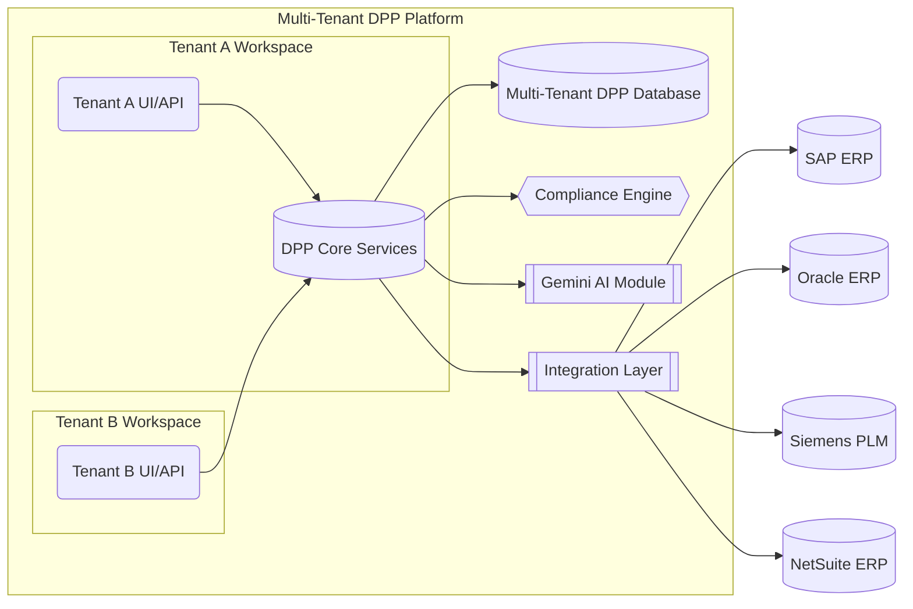

# Platform Architecture

The DPP platform follows a modular, multi-tenant software-as-a-service (SaaS) architecture. All tenants (clients) share the core platform services, but their data and configurations are logically isolated. Major architectural components include:

-   **Core Services**: The heart of the platform, comprising microservices for DPP generation, data storage, compliance rule enforcement, and user management. A centralized DPP Database holds product passport data with tenant-level partitioning.
-   **API & UI Layer**: A unified REST/GraphQL API and web interface through which external applications and users interact with the system. This layer handles authentication and routes requests to the appropriate tenant context.
-   **Integration Layer**: A set of adapters and connectors that interface with external systems (see Integration Models). These connectors transform incoming data (e.g. from an ERP or PLM) into the DPP schema and ensure secure data transfer.
-   **AI Module (Gemini)**: The platform’s AI engine, codenamed Gemini, provides intelligent features such as auto-generating compliance explanations, validating data consistency, and offering suggestions or insights. Gemini is used both for enhancing compliance reporting (e.g., summarizing sustainability metrics) and for improving UX (e.g., explaining errors as in AI-Assisted Error Explanations).
-   **Compliance Rules Engine**: A dynamic engine that applies regional and client-specific compliance rules to the passport data. It uses configurable schemas and rule sets that can be toggled on/off per region or tenant (see Region-Specific Schema Toggles). This ensures that each DPP meets the relevant regulatory requirements (for example, EU battery regulations or upcoming CSRD data points).
-   **Multitenant Management**: Infrastructure that handles tenant onboarding, configuration, and data isolation. Each tenant gets a workspace that includes its own users, roles, data sets, and configurations (enabled features, integrations, etc.), enforced by RBAC at the application and database level.


*Figure: High-level architecture of the DPP Platform. Tenants A and B access shared core services through isolated UIs/APIs. The Core services include compliance logic and interact with an AI module (Gemini) for advanced features. The Integration Layer connects to external enterprise systems like SAP, Oracle, Siemens PLM, and NetSuite. All tenant data is stored in a multi-tenant database with strict access controls.*

## Dynamic Configuration Support

Dynamic configuration is central to making the DPP platform flexible for different clients and regions. The platform supports feature flags and toggles to enable or disable specific modules on a per-tenant or per-region basis at runtime. It is also fully multi-tenant, with robust separation of data and access within workspaces. This section covers how feature flags, multi-tenancy, and regional schema toggles work in concert.

### Feature Flags per Tenant

Feature flags allow granular enabling/disabling of platform capabilities without code changes. Each tenant’s configuration can have certain features turned on or off, enabling customized experiences and phased rollouts. Key points include:

-   **Modular AI and Compliance Features**: For example, a tenant can have the Gemini AI features enabled only if they opt-in. Similarly, specific compliance modules (like a CSRD reporting extension or a particular eco-score calculation) are controlled by flags.
-   **Per-Client Customization**: Feature flags can tailor the platform to each client’s needs or subscription level. A basic tier client might have only core DPP features, whereas an enterprise tier has all AI modules and advanced analytics turned on.
-   **Runtime Toggle**: Flags are evaluated at runtime, often via a configuration service or environment settings, which means features can be switched on/off without deploying new code. This facilitates quick responses to regulatory changes or client requests.
-   **Management**: An Admin Console (or configuration file) allows authorized personnel to set feature flags for each tenant. These settings are stored (for example, in a config database or a service like Firebase Remote Config) and are loaded at tenant login or request time.

Below is an example of a tenant configuration snippet with feature flags in JSON format:

```json
{
  "tenantId": "acme-corp",
  "features": {
    "GeminiAI_Enabled": true,
    "CSRD_Compliance_Module": false,
    "Oracle_ERP_Integration": true,
    "UI_Branding_Customization": true
  },
  "region": "EU"
}
```
*In this example, Acme Corp has Gemini AI features enabled, the CSRD module disabled (perhaps they are not in scope for CSRD yet), Oracle ERP integration enabled, and some UI customization feature enabled. Such a configuration can be updated dynamically as the client’s needs evolve or new regulations come into effect.*
