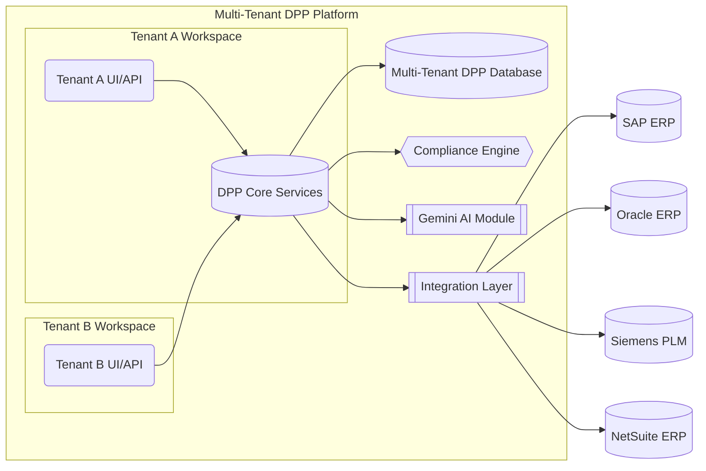

# Platform Architecture

The Norruva DPP platform follows a modular, multi-tenant software-as-a-service (SaaS) architecture. All tenants (clients) share the core platform services, but their data and configurations are logically isolated. Major architectural components include:

-   **Core Services**: The heart of the platform, comprising microservices for DPP generation, data storage, compliance rule enforcement, and user management. A centralized DPP Database holds product passport data with tenant-level partitioning.
-   **API & UI Layer**: A unified REST/GraphQL API and web interface through which external applications and users interact with the system. This layer handles authentication and routes requests to the appropriate tenant context.
-   **Integration Layer**: A set of adapters and connectors that interface with external systems (see Integration Models). These connectors transform incoming data (e.g. from an ERP or PLM) into the DPP schema and ensure secure data transfer.
-   **AI Module (Genkit/Gemini)**: The platform’s AI engine provides intelligent features such as auto-generating compliance explanations, validating data consistency, and offering suggestions or insights. Gemini is used both for enhancing compliance reporting (e.g., summarizing sustainability metrics) and for improving UX (e.g., explaining errors as in AI-Assisted Error Explanations).
-   **Compliance Rules Engine**: A dynamic engine that applies regional and client-specific compliance rules to the passport data. It uses configurable schemas and rule sets that can be toggled on/off per region or tenant (see Region-Specific Schema Toggles). This ensures that each DPP meets the relevant regulatory requirements (for example, EU battery regulations or upcoming CSRD data points).
-   **Multitenant Management**: Infrastructure that handles tenant onboarding, configuration, and data isolation. Each tenant gets a workspace that includes its own users, roles, data sets, and configurations (enabled features, integrations, etc.), enforced by RBAC at the application and database level.


*Figure: High-level architecture of the DPP Platform. Tenants A and B access shared core services through isolated UIs/APIs. The Core services include compliance logic and interact with an AI module (Gemini) for advanced features. The Integration Layer connects to external enterprise systems like SAP, Oracle, Siemens PLM, and NetSuite. All tenant data is stored in a multi-tenant database with strict access controls.*

## Dynamic Configuration Support

Dynamic configuration is central to making the DPP platform flexible for different clients and regions. The platform supports feature flags and toggles to enable or disable specific modules on a per-tenant or per-region basis at runtime. It is also fully multi-tenant, with robust separation of data and access within workspaces. This section covers how feature flags, multi-tenancy, and regional schema toggles work in concert.

### Feature Flags per Tenant

Feature flags allow granular enabling/disabling of platform capabilities without code changes. Each tenant’s configuration can have certain features turned on or off, enabling customized experiences and phased rollouts. Key points include:

-   **Modular AI and Compliance Features**: For example, a tenant can have the Gemini AI features enabled only if they opt-in. Similarly, specific compliance modules (like a CSRD reporting extension or a particular eco-score calculation) are controlled by flags.
-   **Per-Client Customization**: Feature flags can tailor the platform to each client’s needs or subscription level. A basic tier client might have only core DPP features, whereas an enterprise tier has all AI modules and advanced analytics turned on.
-   **Runtime Toggle**: Flags are evaluated at runtime, often via a configuration service or environment settings, which means features can be switched on/off without deploying new code. This facilitates quick responses to regulatory changes or client requests.
-   **Management**: An Admin Console (or configuration file) allows authorized personnel to set feature flags for each tenant. These settings are stored (for example, in a config database or a service like Firebase Remote Config) and are loaded at tenant login or request time.

Below is an example of a tenant configuration snippet with feature flags in JSON format:

```json
{
  "tenantId": "acme-corp",
  "features": {
    "GeminiAI_Enabled": true,
    "CSRD_Compliance_Module": false,
    "Oracle_ERP_Integration": true,
    "UI_Branding_Customization": true
  },
  "region": "EU"
}
```
*In this example, Acme Corp has Gemini AI features enabled, the CSRD module disabled (perhaps they are not in scope for CSRD yet), Oracle ERP integration enabled, and some UI customization feature enabled. Such a configuration can be updated dynamically as the client’s needs evolve or new regulations come into effect.*

### Multi-Tenancy and RBAC Workspaces
The platform is built as a multi-tenant system from the ground up, meaning multiple client organizations (tenants) share the platform securely. Each tenant operates in an isolated workspace with strict RBAC enforcement:
- **Workspace Isolation**: Data records (product passports, compliance documents, etc.) include a tenant identifier. The system’s services always enforce filters by tenant ID, ensuring that one tenant cannot access another’s data. For added safety, separate database schemas or tables per tenant can be used if needed.
- **Role-Based Access Control**: Within each tenant workspace, roles define permissions. Common roles include Admin, Compliance Manager, Data Editor, and Viewer. RBAC ensures separation of duties — e.g., only Admins might toggle features or approve certain changes, while Editors can upload product data but not alter compliance rules.
- **Cross-Tenant Security**: The API uses tenant-scoped credentials or subdomains (e.g., tenantname.dpp.platform.com) to segregate access. Authentication tokens carry tenant context. There is no shared session across tenants.
- **Administration**: A global super-admin (internal to the platform provider) can manage tenants (create, suspend, configure) but even they typically cannot view tenant data without an explicit support workflow. This protects client confidentiality.
- **Scalability**: The multi-tenant design is optimized such that adding new tenants has minimal performance impact. Shared services (like the AI engine or compliance engine) handle requests in a stateless manner, and caching is often segmented by tenant to improve response times for frequently accessed data.

### Region-Specific Schema Toggles
Different regions have different compliance requirements. The platform introduces region-specific toggles to dynamically adjust the DPP data schema and validation rules based on the regulatory context:
- **Regional Mode Setting**: Each tenant (or even each product line) can be tagged with a primary region (e.g., EU, MENA, North America). This drives which compliance schemas and features are active. For instance, a European tenant will have EU-specific fields (like EU battery regulations, material provenance requirements) enabled by default, whereas a North American tenant might not see those unless they opt-in.
- **Schema Variations**: Under the hood, the DPP data model is extensible. Fields can be marked as required, optional, or not applicable depending on region. For example, a “recycled material content” field might be mandatory for EU (due to legislation) but optional elsewhere. The compliance engine references the region toggles to apply correct validation rules.
- **Regional Compliance Modules**: Entire modules can be toggled. An EU toggle might enable the forthcoming Ecodesign/ESPR module (see Ecodesign 2.0 and ESPR), or a Middle East toggle could prepare for any local standards. Toggling off a module hides its UI sections and skips its validations.
- **Examples by Region**:
  - **EU**: Enable Digital Product Passport core plus EU-specific additions (battery passport fields, extended producer responsibility info, CSRD reporting data). Use EU data formats (metric units, EU labeling conventions).
  - **North America**: Core DPP enabled, but EU-specific fields off. Option to enable modules if the company exports to EU. Possibly include US-specific upcoming requirements (e.g., SEC climate disclosures) when relevant.
  - **MENA**: Core DPP enabled; no specific regional compliance rules currently widely mandated, but flexible to incorporate any emerging regulations or to support companies exporting to EU (hence might still enable EU modules on demand).
- **Data Residency**: The region setting can also tie into hosting and data residency (e.g., EU tenants’ data stays in EU data centers by default, to comply with GDPR and local laws).

Below is a table summarizing how regional toggles affect module activation:

| Region | Default Active Modules & Schema | Notes (Compliance Focus) |
| --- | --- | --- |
| European Union (EU) | Core DPP schema; EU Battery Passport fields; CSRD module (covering nearly 50,000 companies); PCDS (Circularity Data Sheet); Ecodesign/ESPR data. | Strong focus on sustainability metrics (e.g., recycled content, carbon footprint) and compliance reporting. Data is stored in EU-region cloud by default to meet GDPR and data sovereignty requirements. |
| Middle East & North Africa (MENA) | Core DPP schema only by default; EU-specific fields off (enable on demand). | Fewer regional mandates yet; companies often comply with EU standards if exporting. Data center can be in-region or EU as needed. |
| North America (NA) | Core DPP schema; EU modules off by default (optional enablement). | Focus on transparency and circular economy is emerging. Prepares for future US regulations; can incorporate EU modules for global companies. Data can be hosted in NA region if needed for latency or compliance. |

Each region’s toggles can be adjusted as laws evolve. The platform’s configuration service updates schemas in near real-time if, say, the EU introduces a new required field or the US enacts a new passport rule, ensuring clients remain compliant without heavy development changes.

## EU Roadmap Frameworks
The regulatory landscape is rapidly evolving, especially in the EU where new sustainability and circular economy directives are coming into force. The DPP platform is built to stay ahead by incorporating a roadmap of EU frameworks as modular components. We have structured placeholders and modules for upcoming regulations such as the CSRD, CRSD, Circular Economy Data Sheets, and Ecodesign 2.0, each of which can be toggled on when relevant. These modules often work in tandem with our Gemini AI for extended functionality, such as automatically interpreting requirements or populating reports.
### CSRD Module
CSRD (Corporate Sustainability Reporting Directive) is a major EU directive requiring companies to report extensively on sustainability metrics and impacts. The platform’s CSRD module is a future rollout component designed to collect and manage the data needed for CSRD compliance:
- Data Fields: The module extends the DPP schema with fields required by CSRD, such as greenhouse gas emissions (Scope 1-3), resource usage, social impact metrics, and governance indicators. It aligns with the European Sustainability Reporting Standards (ESRS) so that DPP data can feed directly into a company’s CSRD reports.
- AI Assistance: The Gemini AI extension for CSRD can help automatically summarize DPP data into narrative form or check consistency (e.g., if a product passport claims a certain carbon footprint, Gemini can verify if it aligns with company-level reports). It might also suggest improvements or flag potential “greenwashing” if data looks inconsistent.
- Toggle and Permissions: Not all clients will need CSRD (for example, non-EU SMEs might be exempt). The feature flag CSRD_Compliance_Module can be turned on per tenant. When off, CSRD-related fields are hidden from UI and not required. When on (likely for large EU companies), the module ensures all required data is collected and can generate a CSRD-ready report or data export.
- Regulatory Alignment: By integrating CSRD, the platform ensures companies can meet their reporting obligations in a structured way. CSRD requires companies to submit sustainability data in a standardized digital format for easier comparison, aiming to end greenwashing and improve transparency normative.io. Our platform can act as the data source, compiling product-level info into the needed format, ensuring companies meet this requirement.
### CRSD Module
CRSD is a placeholder for an additional upcoming regulation (the exact acronym may refer to a Corporate Responsibility/Sustainability Directive or another related law). While details are still emerging, we treat it as a potential expansion of sustainability or due diligence requirements:
- Placeholder Design: The CRSD module is structured similarly to CSRD – as a toggleable schema extension and set of rules. It might include fields for human rights due diligence, supply chain transparency, or other ESG (Environmental, Social, Governance) metrics not fully covered by CSRD.
- Integration with DPP: If CRSD (or a similarly named directive) comes into effect, product passports may need to carry some data that feed into those corporate-level reports. For instance, a “conflict minerals” report or a “social impact score” per product could be introduced.
- Gemini AI Extensions: Our AI would be updated to handle any new explanatory requirements. For example, if companies must explain how each product mitigates a particular risk, the AI could draft these explanations from the data.
- Activating the Module: Like other modules, it would remain off until needed. The documentation here acts as a placeholder so that engineering and product teams are aware of a potential upcoming requirement. Once the regulation details are clear, this module will be updated with specifics.
- Note: If CRSD turns out to be essentially the same as CSRD (or a variant naming), this module might be repurposed to another directive (such as CSDD – Corporate Sustainability Due Diligence for supply chain due diligence). The flexible architecture ensures that even unforeseen regulations can be accommodated with new modules.
### Circular Economy Data Sheets (PCDS)
Under the EU’s circular economy initiatives, standardized data sheets like the Product Circularity Data Sheet (PCDS) are being promoted. Our platform anticipates this by allowing a dedicated module for Circular Economy Data Sheets:
- PCDS Overview: The PCDS is a standardized template that manufacturers fill with info on a product’s circularity (e.g., reused materials, recyclability). Initiatives led by organizations like Luxembourg’s Ministry of the Economy have demonstrated PCDS as a way to communicate the circular properties of products
circulareconomy.europa.eu
. The DPP platform can incorporate this template structure.
- Module Functionality: When the Circular Economy Data Sheets module is enabled, the system will present additional sections in the product passport where circularity data is captured according to the PCDS standard. This might include a series of yes/no or numeric fields about material reuse, recycled content percentage, ease of disassembly, etc., following the standardized statements from PCDS guidelines.
- Data Exchange and Format: Because PCDS is designed as a data exchange format (with an associated protocol and auditing system
circulareconomy.europa.eu
), the platform will be able to export/import this segment of the passport as a PCDS file or API payload. This ensures interoperability: companies can produce a DPP that also serves as a PCDS for partners or auditors.
- Toggle and Integration: The feature flag for this could be named Circularity_DataSheet_Module. It can be enabled for companies that wish to pilot or comply with PCDS. Given that PCDS is still being refined (with pilot projects ongoing
circulareconomy.europa.eu
), our platform’s module will evolve alongside the standard. Gemini AI can assist by checking if PCDS fields are consistent with other product data (e.g., flagging if a product claims “100% recyclable” but has components marked non-recyclable elsewhere).
- Future Alignment: Should the EU or other bodies mandate PCDS for certain products, this module will ensure clients are ready. Even before formal mandates, enabling it can be a value-add for companies aiming to showcase circular economy leadership.
### Ecodesign 2.0 and ESPR
The Ecodesign for Sustainable Products Regulation (ESPR) – sometimes referred to as “Ecodesign 2.0” – is a foundational EU regulation that introduces the requirement for Digital Product Passports. Our platform is inherently aligned with this regulation:
- Digital Product Passport Requirements: The ESPR, which entered into force in July 2024, explicitly introduces a Digital Product Passport as a “digital identity card for products” with information to support sustainability and circularity
commission.europa.eu
. Our entire platform is built around this concept, storing relevant information about products’ technical performance, materials, repairability, recycling, and lifecycle impacts
commission.europa.eu
.
- ESPR Module: While the core platform already addresses much of ESPR (since DPP is its core idea), this module acts as a collection of specific features to ensure full compliance:
- Ensuring each product passport contains all data fields required by any delegated acts under the regulation (e.g., specific rules for electronics, batteries, textiles, etc., as they roll out).
- Providing an authenticity verification mechanism (since ESPR envisions customs authorities checking the existence and authenticity of passports
commission.europa.eu
, our platform may provide a public verification API or QR code scanning feature that can confirm a passport’s validity).
- Enforcement of rules like marking products that lack a valid passport (e.g., preventing generating an incomplete passport for regulated products).
- Future Delegated Acts: The Ecodesign 2.0 framework will issue product-specific rules (delegated acts) defining what data must be in the passport for each product category. The platform’s compliance engine and schema are designed to be updated in a modular way for each such product category rule. For instance, if a rule for textiles requires a new field “percentage of recycled fabric”, we can add that field to the textiles DPP schema and toggle it via region/product category.
- Gemini AI Extensions: Gemini AI is leveraged to help businesses interpret the Ecodesign requirements. For example, if a user is filling out a passport and doesn’t understand a required field (say “reusability score”), the AI can provide context or examples. It can also analyze a product’s data to suggest ways to improve compliance (e.g., hint if a certain component is causing a low recyclability score).
- Global Alignment: While ESPR is EU-specific, it sets a template for sustainability requirements. Our platform’s features here (like capturing detailed lifecycle info) can be useful for other regions or voluntary standards too. Thus, even clients outside the EU benefit from Ecodesign-driven capabilities, as it essentially embodies best practices for sustainable product data.

