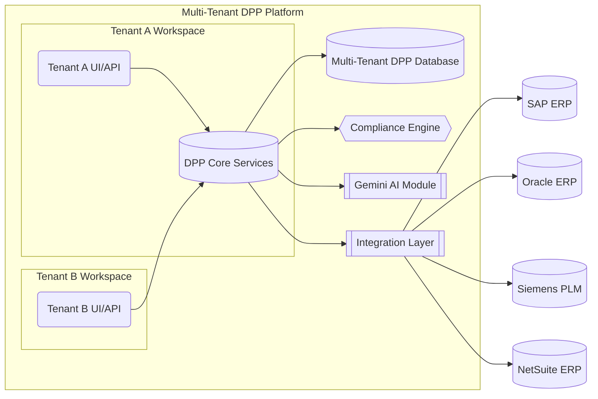

# Platform Architecture

The Norruva DPP platform follows a modular, multi-tenant software-as-a-service (SaaS) architecture. All tenants (clients) share the core platform services, but their data and configurations are logically isolated. Major architectural components include:

-   **Core Services**: The heart of the platform, comprising microservices for DPP generation, data storage, compliance rule enforcement, and user management. A centralized DPP Database holds product passport data with tenant-level partitioning.
-   **API & UI Layer**: A unified REST/GraphQL API and web interface through which external applications and users interact with the system. This layer handles authentication and routes requests to the appropriate tenant context.
-   **Integration Layer**: A set of adapters and connectors that interface with external systems (see Integration Models). These connectors transform incoming data (e.g. from an ERP or PLM) into the DPP schema and ensure secure data transfer.
-   **AI Module (Genkit/Gemini)**: The platform’s AI engine provides intelligent features such as auto-generating compliance explanations, validating data consistency, and offering suggestions or insights. Gemini is used both for enhancing compliance reporting (e.g., summarizing sustainability metrics) and for improving UX (e.g., explaining errors as in AI-Assisted Error Explanations).
-   **Compliance Rules Engine**: A dynamic engine that applies regional and client-specific compliance rules to the passport data. It uses configurable schemas and rule sets that can be toggled on/off per region or tenant (see Region-Specific Schema Toggles). This ensures that each DPP meets the relevant regulatory requirements (for example, EU battery regulations or upcoming CSRD data points).
-   **Multitenant Management**: Infrastructure that handles tenant onboarding, configuration, and data isolation. Each tenant gets a workspace that includes its own users, roles, data sets, and configurations (enabled features, integrations, etc.), enforced by RBAC at the application and database level.


*Figure: High-level architecture of the DPP Platform. Tenants A and B access shared core services through isolated UIs/APIs. The Core services include compliance logic and interact with an AI module (Gemini) for advanced features. The Integration Layer connects to external enterprise systems like SAP, Oracle, Siemens PLM, and NetSuite. All tenant data is stored in a multi-tenant database with strict access controls.*

## Dynamic Configuration Support

Dynamic configuration is central to making the DPP platform flexible for different clients and regions. The platform supports feature flags and toggles to enable or disable specific modules on a per-tenant or per-region basis at runtime. It is also fully multi-tenant, with robust separation of data and access within workspaces. This section covers how feature flags, multi-tenancy, and regional schema toggles work in concert.

### Feature Flags per Tenant

Feature flags allow granular enabling/disabling of platform capabilities without code changes. Each tenant’s configuration can have certain features turned on or off, enabling customized experiences and phased rollouts. Key points include:

-   **Modular AI and Compliance Features**: For example, a tenant can have the Gemini AI features enabled only if they opt-in. Similarly, specific compliance modules (like a CSRD reporting extension or a particular eco-score calculation) are controlled by flags.
-   **Per-Client Customization**: Feature flags can tailor the platform to each client’s needs or subscription level. A basic tier client might have only core DPP features, whereas an enterprise tier has all AI modules and advanced analytics turned on.
-   **Runtime Toggle**: Flags are evaluated at runtime, often via a configuration service or environment settings, which means features can be switched on/off without deploying new code. This facilitates quick responses to regulatory changes or client requests.
-   **Management**: An Admin Console (or configuration file) allows authorized personnel to set feature flags for each tenant. These settings are stored (for example, in a config database or a service like Firebase Remote Config) and are loaded at tenant login or request time.

Below is an example of a tenant configuration snippet with feature flags in JSON format:

```json
{
  "tenantId": "acme-corp",
  "features": {
    "GeminiAI_Enabled": true,
    "CSRD_Compliance_Module": false,
    "Oracle_ERP_Integration": true,
    "UI_Branding_Customization": true
  },
  "region": "EU"
}
```
*In this example, Acme Corp has Gemini AI features enabled, the CSRD module disabled (perhaps they are not in scope for CSRD yet), Oracle ERP integration enabled, and some UI customization feature enabled. Such a configuration can be updated dynamically as the client’s needs evolve or new regulations come into effect.*

### Multi-Tenancy and RBAC Workspaces
The platform is built as a multi-tenant system from the ground up, meaning multiple client organizations (tenants) share the platform securely. Each tenant operates in an isolated workspace with strict RBAC enforcement:
- **Workspace Isolation**: Data records (product passports, compliance documents, etc.) include a tenant identifier. The system’s services always enforce filters by tenant ID, ensuring that one tenant cannot access another’s data. For added safety, separate database schemas or tables per tenant can be used if needed.
- **Role-Based Access Control**: Within each tenant workspace, roles define permissions. Common roles include Admin, Compliance Manager, Data Editor, and Viewer. RBAC ensures separation of duties — e.g., only Admins might toggle features or approve certain changes, while Editors can upload product data but not alter compliance rules.
- **Cross-Tenant Security**: The API uses tenant-scoped credentials or subdomains (e.g., tenantname.dpp.platform.com) to segregate access. Authentication tokens carry tenant context. There is no shared session across tenants.
- **Administration**: A global super-admin (internal to the platform provider) can manage tenants (create, suspend, configure) but even they typically cannot view tenant data without an explicit support workflow. This protects client confidentiality.
- **Scalability**: The multi-tenant design is optimized such that adding new tenants has minimal performance impact. Shared services (like the AI engine or compliance engine) handle requests in a stateless manner, and caching is often segmented by tenant to improve response times for frequently accessed data.

### Region-Specific Schema Toggles
Different regions have different compliance requirements. The platform introduces region-specific toggles to dynamically adjust the DPP data schema and validation rules based on the regulatory context:
- **Regional Mode Setting**: Each tenant (or even each product line) can be tagged with a primary region (e.g., EU, North America). This drives which compliance schemas and features are active. For instance, a European tenant will have EU-specific fields (like EU battery regulations, material provenance requirements) enabled by default, whereas a North American tenant might not see those unless they opt-in.
- **Schema Variations**: Under the hood, the DPP data model is extensible. Fields can be marked as required, optional, or not applicable depending on region. For example, a “recycled material content” field might be mandatory for EU (due to legislation) but optional elsewhere. The compliance engine references the region toggles to apply correct validation rules.
- **Regional Compliance Modules**: Entire modules can be toggled. An EU toggle might enable the forthcoming Ecodesign/ESPR module, or a North American toggle could enable modules for FTC Green Guides or state-level EPR laws. Toggling off a module hides its UI sections and skips its validations.
- **Data Residency**: The region setting can also tie into hosting and data residency (e.g., EU tenants’ data stays in EU data centers by default, to comply with GDPR and local laws).

### EU Roadmap Frameworks
The regulatory landscape is rapidly evolving, especially in the EU where new sustainability and circular economy directives are coming into force. The DPP platform is built to stay ahead by incorporating a roadmap of EU frameworks as modular components. We have structured placeholders and modules for upcoming regulations such as the CSRD, PCDS, and ESPR, each of which can be toggled on when relevant.

#### CSRD Module
The Corporate Sustainability Reporting Directive (CSRD) requires large companies to report on sustainability impacts.
- **Data Fields**: The platform will extend the DPP schema with fields that can feed into ESRS (European Sustainability Reporting Standards) reports, such as product-level carbon footprints, water usage, and social impact metrics.
- **AI Assistance**: Genkit can help summarize DPP data into narratives for CSRD reports or flag inconsistencies between product claims and corporate-level disclosures.
- **Toggle**: A `CSRD_Compliance_Module` feature flag will be available for in-scope companies.

#### PCDS Module
The Product Circularity Data Sheet (PCDS) is a standardized format for communicating circularity properties.
- **Functionality**: When enabled, the platform will capture data according to the PCDS standard, including material reuse, recycled content, and disassembly information.
- **Interoperability**: The platform will be able to export a product's circularity data as a standardized PCDS file or API payload, ensuring interoperability with other systems.
- **Toggle**: The `Circularity_DataSheet_Module` flag will enable PCDS features.

#### ESPR Module
The Ecodesign for Sustainable Products Regulation (ESPR) is the foundational EU regulation mandating DPPs.
- **Core Alignment**: The entire platform is built around ESPR principles, providing a digital identity card for products.
- **Functionality**: The ESPR module ensures full compliance by enforcing data requirements from delegated acts, providing authenticity verification for customs, and managing product markings.
- **Future-Proof**: As product-specific rules are released, the compliance engine will be updated modularly.
