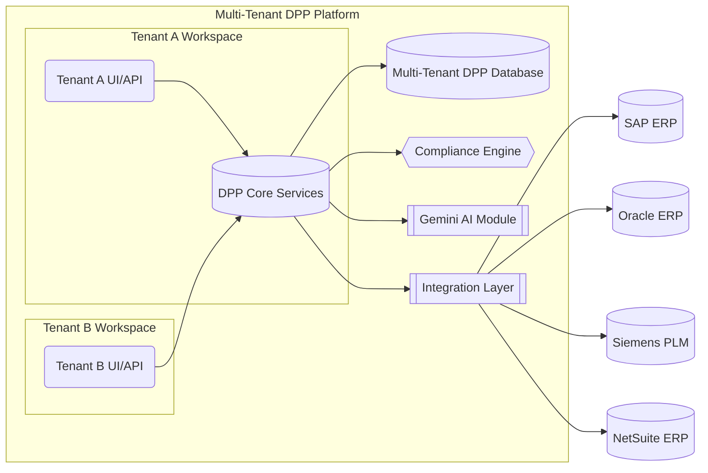
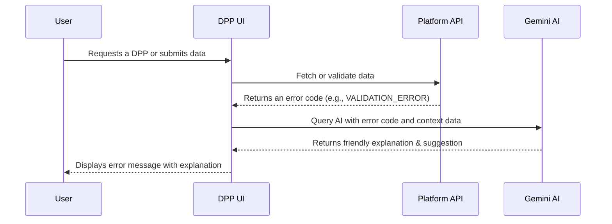

# Platform Architecture

The DPP platform follows a modular, multi-tenant software-as-a-service (SaaS) architecture. All tenants (clients) share the core platform services, but their data and configurations are logically isolated. Major architectural components include:

-   **Core Services**: The heart of the platform, comprising microservices for DPP generation, data storage, compliance rule enforcement, and user management. A centralized DPP Database holds product passport data with tenant-level partitioning.
-   **API & UI Layer**: A unified REST/GraphQL API and web interface through which external applications and users interact with the system. This layer handles authentication and routes requests to the appropriate tenant context.
-   **Integration Layer**: A set of adapters and connectors that interface with external systems (see Integration Models). These connectors transform incoming data (e.g. from an ERP or PLM) into the DPP schema and ensure secure data transfer.
-   **AI Module (Gemini)**: The platform’s AI engine, codenamed Gemini, provides intelligent features such as auto-generating compliance explanations, validating data consistency, and offering suggestions or insights. Gemini is used both for enhancing compliance reporting (e.g., summarizing sustainability metrics) and for improving UX (e.g., explaining errors as in AI-Assisted Error Explanations).
-   **Compliance Rules Engine**: A dynamic engine that applies regional and client-specific compliance rules to the passport data. It uses configurable schemas and rule sets that can be toggled on/off per region or tenant (see Region-Specific Schema Toggles). This ensures that each DPP meets the relevant regulatory requirements (for example, EU battery regulations or upcoming CSRD data points).
-   **Multitenant Management**: Infrastructure that handles tenant onboarding, configuration, and data isolation. Each tenant gets a workspace that includes its own users, roles, data sets, and configurations (enabled features, integrations, etc.), enforced by RBAC at the application and database level.


*Figure: High-level architecture of the DPP Platform. Tenants A and B access shared core services through isolated UIs/APIs. The Core services include compliance logic and interact with an AI module (Gemini) for advanced features. The Integration Layer connects to external enterprise systems like SAP, Oracle, Siemens PLM, and NetSuite. All tenant data is stored in a multi-tenant database with strict access controls.*

## Dynamic Configuration Support

Dynamic configuration is central to making the DPP platform flexible for different clients and regions. The platform supports feature flags and toggles to enable or disable specific modules on a per-tenant or per-region basis at runtime. It is also fully multi-tenant, with robust separation of data and access within workspaces. This section covers how feature flags, multi-tenancy, and regional schema toggles work in concert.

### Feature Flags per Tenant

Feature flags allow granular enabling/disabling of platform capabilities without code changes. Each tenant’s configuration can have certain features turned on or off, enabling customized experiences and phased rollouts. Key points include:

-   **Modular AI and Compliance Features**: For example, a tenant can have the Gemini AI features enabled only if they opt-in. Similarly, specific compliance modules (like a CSRD reporting extension or a particular eco-score calculation) are controlled by flags.
-   **Per-Client Customization**: Feature flags can tailor the platform to each client’s needs or subscription level. A basic tier client might have only core DPP features, whereas an enterprise tier has all AI modules and advanced analytics turned on.
-   **Runtime Toggle**: Flags are evaluated at runtime, often via a configuration service or environment settings, which means features can be switched on/off without deploying new code. This facilitates quick responses to regulatory changes or client requests.
-   **Management**: An Admin Console (or configuration file) allows authorized personnel to set feature flags for each tenant. These settings are stored (for example, in a config database or a service like Firebase Remote Config) and are loaded at tenant login or request time.

Below is an example of a tenant configuration snippet with feature flags in JSON format:

```json
{
  "tenantId": "acme-corp",
  "features": {
    "GeminiAI_Enabled": true,
    "CSRD_Compliance_Module": false,
    "Oracle_ERP_Integration": true,
    "UI_Branding_Customization": true
  },
  "region": "EU"
}
```
*In this example, Acme Corp has Gemini AI features enabled, the CSRD module disabled (perhaps they are not in scope for CSRD yet), Oracle ERP integration enabled, and some UI customization feature enabled. Such a configuration can be updated dynamically as the client’s needs evolve or new regulations come into effect.*

### Multi-Tenancy and RBAC Workspaces
The platform is built as a multi-tenant system from the ground up, meaning multiple client organizations (tenants) share the platform securely. Each tenant operates in an isolated workspace with strict RBAC enforcement:
- **Workspace Isolation**: Data records (product passports, compliance documents, etc.) include a tenant identifier. The system’s services always enforce filters by tenant ID, ensuring that one tenant cannot access another’s data. For added safety, separate database schemas or tables per tenant can be used if needed.
- **Role-Based Access Control**: Within each tenant workspace, roles define permissions. Common roles include Admin, Compliance Manager, Data Editor, and Viewer. RBAC ensures separation of duties — e.g., only Admins might toggle features or approve certain changes, while Editors can upload product data but not alter compliance rules.
- **Cross-Tenant Security**: The API uses tenant-scoped credentials or subdomains (e.g., tenantname.dpp.platform.com) to segregate access. Authentication tokens carry tenant context. There is no shared session across tenants.
- **Administration**: A global super-admin (internal to the platform provider) can manage tenants (create, suspend, configure) but even they typically cannot view tenant data without an explicit support workflow. This protects client confidentiality.
- **Scalability**: The multi-tenant design is optimized such that adding new tenants has minimal performance impact. Shared services (like the AI engine or compliance engine) handle requests in a stateless manner, and caching is often segmented by tenant to improve response times for frequently accessed data.

### Region-Specific Schema Toggles
Different regions have different compliance requirements. The platform introduces region-specific toggles to dynamically adjust the DPP data schema and validation rules based on the regulatory context:
- **Regional Mode Setting**: Each tenant (or even each product line) can be tagged with a primary region (e.g., EU, MENA, North America). This drives which compliance schemas and features are active. For instance, a European tenant will have EU-specific fields (like EU battery regulations, material provenance requirements) enabled by default, whereas a North American tenant might not see those unless they opt-in.
- **Schema Variations**: Under the hood, the DPP data model is extensible. Fields can be marked as required, optional, or not applicable depending on region. For example, a “recycled material content” field might be mandatory for EU (due to legislation) but optional elsewhere. The compliance engine references the region toggles to apply correct validation rules.
- **Regional Compliance Modules**: Entire modules can be toggled. An EU toggle might enable the forthcoming Ecodesign/ESPR module (see Ecodesign 2.0 and ESPR), or a Middle East toggle could prepare for any local standards. Toggling off a module hides its UI sections and skips its validations.
- **Examples by Region**:
  - **EU**: Enable Digital Product Passport core plus EU-specific additions (battery passport fields, extended producer responsibility info, CSRD reporting data). Use EU data formats (metric units, EU labeling conventions).
  - **North America**: Core DPP enabled, but EU-specific fields off. Option to enable modules if the company exports to EU. Possibly include US-specific upcoming requirements (e.g., SEC climate disclosures) when relevant.
  - **MENA**: Core DPP enabled; no specific regional compliance rules currently widely mandated, but flexible to incorporate any emerging regulations or to support companies exporting to EU (hence might still enable EU modules on demand).
- **Data Residency**: The region setting can also tie into hosting and data residency (e.g., EU tenants’ data stays in EU data centers by default, to comply with GDPR and local laws).

Below is a table summarizing how regional toggles affect module activation:

| Region | Default Active Modules &amp; Schema | Notes (Compliance Focus) |
| --- | --- | --- |
| European Union (EU) | Core DPP schema; EU Battery Passport fields; CSRD module (covering nearly 50,000 companies); PCDS (Circularity Data Sheet); Ecodesign/ESPR data. | Strong focus on sustainability metrics (e.g., recycled content, carbon footprint) and compliance reporting. Data is stored in EU-region cloud by default to meet GDPR and data sovereignty requirements. |
| Middle East &amp; North Africa (MENA) | Core DPP schema only by default; EU-specific fields off (enable on demand). | Fewer regional mandates yet; companies often comply with EU standards if exporting. Data center can be in-region or EU as needed. |
| North America (NA) | Core DPP schema; EU modules off by default (optional enablement). | Focus on transparency and circular economy is emerging. Prepares for future US regulations; can incorporate EU modules for global companies. Data can be hosted in NA region if needed for latency or compliance. |

Each region’s toggles can be adjusted as laws evolve. The platform’s configuration service updates schemas in near real-time if, say, the EU introduces a new required field or the US enacts a new passport rule, ensuring clients remain compliant without heavy development changes.

## EU Roadmap Frameworks
The regulatory landscape is rapidly evolving, especially in the EU where new sustainability and circular economy directives are coming into force. The DPP platform is built to stay ahead by incorporating a roadmap of EU frameworks as modular components. We have structured placeholders and modules for upcoming regulations such as the CSRD, CRSD, Circular Economy Data Sheets, and Ecodesign 2.0, each of which can be toggled on when relevant. These modules often work in tandem with our Gemini AI for extended functionality, such as automatically interpreting requirements or populating reports.
### CSRD Module
CSRD (Corporate Sustainability Reporting Directive) is a major EU directive requiring companies to report extensively on sustainability metrics and impacts. The platform’s CSRD module is a future rollout component designed to collect and manage the data needed for CSRD compliance:
- Data Fields: The module extends the DPP schema with fields required by CSRD, such as greenhouse gas emissions (Scope 1-3), resource usage, social impact metrics, and governance indicators. It aligns with the European Sustainability Reporting Standards (ESRS) so that DPP data can feed directly into a company’s CSRD reports.
- AI Assistance: The Gemini AI extension for CSRD can help automatically summarize DPP data into narrative form or check consistency (e.g., if a product passport claims a certain carbon footprint, Gemini can verify if it aligns with company-level reports). It might also suggest improvements or flag potential “greenwashing” if data looks inconsistent.
- Toggle and Permissions: Not all clients will need CSRD (for example, non-EU SMEs might be exempt). The feature flag CSRD_Compliance_Module can be turned on per tenant. When off, CSRD-related fields are hidden from UI and not required. When on (likely for large EU companies), the module ensures all required data is collected and can generate a CSRD-ready report or data export.
- Regulatory Alignment: By integrating CSRD, the platform ensures companies can meet their reporting obligations in a structured way. CSRD requires companies to submit sustainability data in a standardized digital format for easier comparison, aiming to end greenwashing and improve transparency normative.io. Our platform can act as the data source, compiling product-level info into the needed format, ensuring companies meet this requirement.
### CRSD Module
CRSD is a placeholder for an additional upcoming regulation (the exact acronym may refer to a Corporate Responsibility/Sustainability Directive or another related law). While details are still emerging, we treat it as a potential expansion of sustainability or due diligence requirements:
- Placeholder Design: The CRSD module is structured similarly to CSRD – as a toggleable schema extension and set of rules. It might include fields for human rights due diligence, supply chain transparency, or other ESG (Environmental, Social, Governance) metrics not fully covered by CSRD.
- Integration with DPP: If CRSD (or a similarly named directive) comes into effect, product passports may need to carry some data that feed into those corporate-level reports. For instance, a “conflict minerals” report or a “social impact score” per product could be introduced.
- Gemini AI Extensions: Our AI would be updated to handle any new explanatory requirements. For example, if companies must explain how each product mitigates a particular risk, the AI could draft these explanations from the data.
- Activating the Module: Like other modules, it would remain off until needed. The documentation here acts as a placeholder so that engineering and product teams are aware of a potential upcoming requirement. Once the regulation details are clear, this module will be updated with specifics.
- Note: If CRSD turns out to be essentially the same as CSRD (or a variant naming), this module might be repurposed to another directive (such as CSDD – Corporate Sustainability Due Diligence for supply chain due diligence). The flexible architecture ensures that even unforeseen regulations can be accommodated with new modules.
### Circular Economy Data Sheets (PCDS)
Under the EU’s circular economy initiatives, standardized data sheets like the Product Circularity Data Sheet (PCDS) are being promoted. Our platform anticipates this by allowing a dedicated module for Circular Economy Data Sheets:
- PCDS Overview: The PCDS is a standardized template that manufacturers fill with info on a product’s circularity (e.g., reused materials, recyclability). Initiatives led by organizations like Luxembourg’s Ministry of the Economy have demonstrated PCDS as a way to communicate the circular properties of products
circulareconomy.europa.eu
. The DPP platform can incorporate this template structure.
- Module Functionality: When the Circular Economy Data Sheets module is enabled, the system will present additional sections in the product passport where circularity data is captured according to the PCDS standard. This might include a series of yes/no or numeric fields about material reuse, recycled content percentage, ease of disassembly, etc., following the standardized statements from PCDS guidelines.
- Data Exchange and Format: Because PCDS is designed as a data exchange format (with an associated protocol and auditing system
circulareconomy.europa.eu
), the platform will be able to export/import this segment of the passport as a PCDS file or API payload. This ensures interoperability: companies can produce a DPP that also serves as a PCDS for partners or auditors.
- Toggle and Integration: The feature flag for this could be named Circularity_DataSheet_Module. It can be enabled for companies that wish to pilot or comply with PCDS. Given that PCDS is still being refined (with pilot projects ongoing
circulareconomy.europa.eu
), our platform’s module will evolve alongside the standard. Gemini AI can assist by checking if PCDS fields are consistent with other product data (e.g., flagging if a product claims “100% recyclable” but has components marked non-recyclable elsewhere).
- Future Alignment: Should the EU or other bodies mandate PCDS for certain products, this module will ensure clients are ready. Even before formal mandates, enabling it can be a value-add for companies aiming to showcase circular economy leadership.
### Ecodesign 2.0 and ESPR
The Ecodesign for Sustainable Products Regulation (ESPR) – sometimes referred to as “Ecodesign 2.0” – is a foundational EU regulation that introduces the requirement for Digital Product Passports. Our platform is inherently aligned with this regulation:
- Digital Product Passport Requirements: The ESPR, which entered into force in July 2024, explicitly introduces a Digital Product Passport as a “digital identity card for products” with information to support sustainability and circularity
commission.europa.eu
. Our entire platform is built around this concept, storing relevant information about products’ technical performance, materials, repairability, recycling, and lifecycle impacts
commission.europa.eu
.
- ESPR Module: While the core platform already addresses much of ESPR (since DPP is its core idea), this module acts as a collection of specific features to ensure full compliance:
- Ensuring each product passport contains all data fields required by any delegated acts under the regulation (e.g., specific rules for electronics, batteries, textiles, etc., as they roll out).
- Providing an authenticity verification mechanism (since ESPR envisions customs authorities checking the existence and authenticity of passports
commission.europa.eu
, our platform may provide a public verification API or QR code scanning feature that can confirm a passport’s validity).
- Enforcement of rules like marking products that lack a valid passport (e.g., preventing generating an incomplete passport for regulated products).
- Future Delegated Acts: The Ecodesign 2.0 framework will issue product-specific rules (delegated acts) defining what data must be in the passport for each product category. The platform’s compliance engine and schema are designed to be updated in a modular way for each such product category rule. For instance, if a rule for textiles requires a new field “percentage of recycled fabric”, we can add that field to the textiles DPP schema and toggle it via region/product category.
- Gemini AI Extensions: Gemini AI is leveraged to help businesses interpret the Ecodesign requirements. For example, if a user is filling out a passport and doesn’t understand a required field (say “reusability score”), the AI can provide context or examples. It can also analyze a product’s data to suggest ways to improve compliance (e.g., hint if a certain component is causing a low recyclability score).
- Global Alignment: While ESPR is EU-specific, it sets a template for sustainability requirements. Our platform’s features here (like capturing detailed lifecycle info) can be useful for other regions or voluntary standards too. Thus, even clients outside the EU benefit from Ecodesign-driven capabilities, as it essentially embodies best practices for sustainable product data.

## UX Fallback States and Resilience
A critical aspect of the platform is its resilience in the face of incomplete or problematic data. The user experience (UX) has been designed to gracefully handle cases where a Digital Product Passport is partial, expired, or invalid. Instead of failing silently or showing technical errors, the UI (with help from Gemini AI) provides informative feedback and paths to resolution. Additionally, administrative users have tools to override or rollback changes when necessary, ensuring that business operations can continue smoothly even when issues arise.
### Handling Partial DPPs
Sometimes a passport may not have all the required information – perhaps a supplier hasn’t provided certain data, or a new regulation adds required fields that are not yet filled. The platform handles these partial DPPs by:
- Visual Cues: The UI will clearly mark missing information sections (e.g., highlighting empty required fields with a placeholder like “Data pending” or an icon). This allows viewers to know the passport is not complete.
- Guidance Messages: A banner or note at the top of the DPP might state: “This passport is currently incomplete. Some data is pending or in progress.” If the Gemini AI has context, it could add: e.g. “Awaiting supplier data on material composition” to pinpoint what’s missing.
- Restricted Actions: Certain actions (like publishing the DPP publicly or using it to satisfy a compliance check) may be disabled if the passport is flagged partial. The UI will inform the user why: “Passport cannot be published because it is missing required regulatory fields.”
- Progress Tracking: For users filling out a DPP, a progress bar or checklist can show completion status. E.g., 8/10 sections completed. This encourages finishing the data entry.
- Fallback Data Use: If partial data is acceptable (for example, a provisional passport for internal use), the system will still display what is available rather than blocking entirely. It errs on the side of showing partial info with warnings, rather than nothing.
### Expired or Invalid Passports
Digital Product Passports may have an expiration (for instance, if tied to a certification that expires, or simply to prompt periodic review). Additionally, a passport might be deemed invalid if data is corrupted or fails verification (like a digital signature mismatch). The UX in these cases:
- Expiration Handling: The system tracks expiry dates for passports (if applicable). An expired passport is labeled clearly (e.g., “Expired” badge). The UI might use a muted color scheme for expired passports. Users attempting to view an expired passport get a warning banner: “This product passport expired on YYYY-MM-DD and may contain out-of-date information.”
- Invalid Data Warnings: If a passport’s integrity check fails (say the QR code was tampered, or required validations fail), the UI shows an error state. For example, “Error: Passport data invalid or corrupted.” It will not display potentially misleading data; instead, it might show only certain safe fields or nothing beyond the error.
- Gemini AI Explanations: In both cases, the AI can provide a user-friendly explanation. For expiry: “The passport has passed its validity period, which could be due to an update requirement. Please contact the manufacturer for the latest information.” For invalid: “The passport data failed our verification checks (e.g., a checksum didn’t match). This could indicate it was altered or generated incorrectly.”
- Preventing Use: The system may prevent some interactions with invalid/expired passports, such as printing an official certificate or syncing to external systems, to ensure no one relies on an outdated or wrong passport.
The table below summarizes UI behavior for different problematic passport states:

| Scenario | UI Behavior | Example Outcome |
| --- | --- | --- |
| Partial Passport (Incomplete Data) | Show available data; highlight missing fields; banner indicating passport is incomplete. Possibly provide reason (e.g., “Waiting for supplier X’s data”). | User views passport: sees most fields, but “Material Origin: (pending data)” highlighted. A message at top explains some data is missing. |
| Expired Passport | Display passport with “Expired” label; banner warning user; data is shown but marked as possibly outdated. | User scans product QR: passport opens with a red “Expired on 2025-12-31” notice. The details are visible but a warning advises to check for updates. |
| Invalid Passport | Do not show normal passport details; show error message and explanation; offer support contact or retry if possible. | User attempts to open passport: instead of product info, sees “Error: Passport data invalid (verification failed).” Gemini AI suggests “This could be due to data corruption. Please verify the QR code or contact support.” |

## AI-Assisted Error Explanations
One of the standout features is how the platform leverages the Gemini AI to turn technical errors or complex compliance issues into understandable explanations:
- Dynamic Error Interpretation: When an error occurs (e.g., a validation fails on upload, or an integration record is rejected), the system generates an error code and description. Gemini AI then interprets this in plain language for the user. For example, a raw error “Field X required by regulation Y missing” can be transformed into: “The recycling information is missing, which is required under EU law. Please add the recycling details to proceed.”
- User Suggestions: Beyond just explaining, the AI often suggests next steps: “Try editing the Materials section to include the composition details” or “Contact your compliance manager to provide the missing certificate.” These suggestions are context-aware.
- Multi-language Explanations: In line with our i18n support (see Internationalization and Localization), Gemini can output explanations in the user’s preferred language, using terminology that local users understand.
- Confidence and Accuracy: The AI’s explanations are based on the rules and data in the system, so it is less likely to hallucinate information. It may include references to internal documentation for further help (e.g., link to a help article or internal policy if available).
- Admin vs User Messaging: The system differentiates between end-user messages and admin messages. End-users (like a consumer scanning a passport) get very simple, action-oriented messages (“This passport is invalid, please try again later or contact support.”). Admin or power users get more detail (“Passport invalid: signature mismatch. Possible causes: data tampering or system error. You may override this if you have verified the physical documents.”).
- Logging: All AI-provided explanations are logged, both for improvement (learning from common issues) and for compliance (keeping a record of what was communicated to users).
A simplified sequence for an AI-assisted error might be:

*Figure: Sequence of Gemini AI providing an error explanation. The UI receives an error code from the backend and queries the AI module for a human-readable explanation, which is then shown to the user.*
### Admin Overrides and Rollbacks
In scenarios where strict validations or automated flows impede urgent business needs, administrators have tools to override or rollback changes:
- Override Workflows: An admin user can manually override certain validation failures. For example, if a regulatory field is missing but the product must be shipped, an admin might mark the passport as “provisionally valid” with a justification. The system logs who overrode what and why (for audit trail).
- Version History: Every DPP record can maintain a history of changes (versions). If a new update renders a passport invalid or if incorrect data was uploaded, an admin can rollback to a prior version. The UI provides a version list with timestamps and the user who made changes, akin to document version control.
- Approval Gates: For sensitive actions like deletion or forced expiry of a passport, the platform can require dual approval (two different admin users confirming) to avoid accidental or malicious overrides.
- Maintenance Mode: In cases of widespread issues (say a faulty integration corrupts many records), the platform can be put into a “maintenance mode” for a tenant, where normal users see a friendly maintenance message while admins work to repair data or rollback en masse.
- Audit and Accountability: All overrides and rollbacks trigger notifications to key personnel (e.g., the compliance officer of that tenant). This way, manual interventions are transparent. The platform might also require entering a reason for override so that later audits can review why it was done.
- Gemini’s Role: The AI is also useful here – it can assist admins by highlighting what changed between versions (“This field X changed from 5.0 to 0, which is outside expected range”) to help decide if a rollback is needed. It can even recommend which version seems “most correct” if anomalies are detected.
By combining careful UX design for errors and empowering admins with override capabilities, the platform ensures that even when things go wrong, users are informed and the situation can be corrected with minimal disruption.

## Internationalization and Localization

As a globally deployed platform, the DPP system is built with internationalization (i18n) in mind. All user-facing text, units, and regulatory references can adapt to the user’s locale. Moreover, the platform supports rendering the product passport content in multiple languages, which is crucial when products cross borders and have stakeholders speaking different languages. This section describes our approach to i18n, multi-language content, and how we handle translations and local regulatory context.

### i18n Infrastructure

Our platform uses a robust i18n infrastructure (leveraging either a framework like i18next for web or utilizing services like Firebase Remote Config or third-party localization platforms for dynamic content). Key features:

-   **Language Packs**: UI text and messages are stored in resource bundles for each supported language (e.g., English, French, Arabic, Chinese, etc.). Adding a new language is as simple as providing a new set of translations for these resources. We currently maintain translations for all major interface elements, error messages, and notifications.
-   **Dynamic Language Switching**: Users can select their preferred language in the interface, or it can be auto-detected from their browser settings. The change takes effect immediately (no re-login required), and all UI elements render in the chosen language.
-   **Date/Number/Unit Localization**: The platform automatically formats dates, numbers, and units based on locale. For example, a weight might show in kilograms in one locale vs pounds in another, or a date might display as DD/MM/YYYY vs MM/DD/YYYY depending on region. This is handled by our localization library to ensure consistency.
-   **Right-to-Left (RTL) Support**: For languages such as Arabic, the UI seamlessly switches to an RTL layout. We have tested components to ensure they render correctly in both LTR and RTL orientations.
-   **Firebase Integration (optional)**: For clients that want to manage certain text (like help content or glossary terms) dynamically, we can fetch those from Firebase or a CMS. This means updates to explanatory text or disclaimers don’t require a code deployment and can be localized on the fly.

Below is an excerpt of a localization JSON showing translations for a couple of text strings in different languages:

```json
{
  "passport_status_expired": {
    "en": "This product passport has expired.",
    "fr": "Ce passeport produit est expiré.",
    "de": "Dieser Produktpass ist abgelaufen.",
    "ar": "انتهت صلاحية جواز المنتج الرقمي هذا."
  },
  "action_override": {
    "en": "Override",
    "fr": "Outrepasser",
    "de": "Übersteuern",
    "ar": "تجاوز"
  }
}
```

This illustrates how the system stores multiple localizations for each key. The UI would use the key `passport_status_expired` and show the message in the appropriate language context.

### Multi-language DPP Rendering

Beyond the UI chrome, the content of the Digital Product Passports themselves may need to be translated. For example, a product description or a compliance note might need to be accessible in several languages:

-   **Field Level Localization**: The DPP schema supports multi-language fields. For any text attribute (like “Product Name” or “Material Description”), the database can store translations. E.g., `product_name_en`, `product_name_fr`, etc., or a structure like `product_name: {en: "...", fr: "..."}`. This allows the actual product data to appear in the viewer’s language when possible.
-   **Document Language Toggle**: In the UI, if a passport has multiple languages available, a viewer can switch the language of the content. For instance, an Italian user could switch an English passport to display Italian, seeing all fields (that have translations) in Italian.
-   **Default by Region/User**: The system can automatically show the passport in the language that matches the user’s locale, if available. If not available, it falls back to a default (often English or the original language of entry).
-   **AI Translation Aid**: If a certain field is not translated, the platform can use Gemini AI to provide an on-the-fly translation suggestion. This is labeled clearly (e.g., “AI-translated”) and can be reviewed by a human for accuracy. Over time, these suggestions can be saved to enhance the passport’s data.
-   **Regulatory Texts**: Some passports might include standard regulatory phrases or safety instructions. We maintain a library of these in multiple languages, so if a passport needs to display “Compliant with EU Regulation XYZ”, we can show the exact phrasing in French or German as needed.
-   **Formatting**: Certain languages have text expansion (German tends to be longer, for example) — our UI is designed with flexible layouts to accommodate this without breaking.

### Smart Label Translation

An important aspect of DPPs is the use of labels or codes for materials, chemicals, or components which might be technical. The platform incorporates logic to intelligently translate or clarify such labels:

-   **Material and Component Labels**: Suppose a DPP lists a material code “PA66 GF30” (a plastic type). A casual user might not know what that means. The system can have a built-in glossary that identifies this as “Polyamide 66, 30% glass fiber” and then, using i18n, display a more understandable name in the user’s language.
-   **AI-driven Label Recognition**: If an unknown term appears, Gemini AI can attempt to detect what it is (maybe from context or an internal database) and provide a translation or description. For instance, a French user sees “Stainless Steel (Grade 304)” which is originally in English; the platform could show “Acier inoxydable (Grade 304)” automatically.
-   **Regulatory Codes Interpretation**: Many products have codes like “REACH SVHC: Yes” or “RoHS Compliant”. The platform will show a tooltip or note explaining “SVHC” (Substance of Very High Concern) in the user’s language, perhaps with a link to more info. These explanations are pre-translated and reviewed by compliance experts for accuracy in each language.
-   **Contextual Localization**: Smart translation also means understanding where not to translate. For example, part numbers or proper nouns remain unchanged, but units or generic names do. Our rules ensure that, say, “ISO 14001 Certification” remains that and isn’t oddly translated, but the word “Certification” itself might be shown as “Zertifizierung” for a German context if it stands alone.
-   **Learning from Users**: If users manually override a translation or provide a better one, the system can learn from that (especially for internal company-specific terminology). Admins might have a section to manage custom glossary entries for their own products.

### Regulatory Context Localization

Interpreting compliance data correctly often depends on local regulations and language:

-   **Local Regulatory References**: If a DPP references a regulation, e.g., “EU Regulation 2018/851”, the platform can detect the region of the user and provide context. A user in Germany might see additionally “(Umgesetzt in deutsches Recht durch das Kreislaufwirtschaftsgesetz)” – i.e., how that EU regulation is known locally.
-   **Units and Standards Conversion**: A product passport might contain values that need context. For example, a limit of a chemical in ppm (parts per million) might have different legal limits in different regions. While the passport will always list the value, the platform might display a note like “Complies with EU limit of 1000 ppm” vs “Complies with US limit of 500 ppm” depending on locale. Essentially, it cross-references the data with the region’s rules.
-   **Compliance Status per Region**: If a product is compliant in one region but not another, and a user from that other region views the passport, the UI could proactively warn them. E.g., “Note: This product meets EU standards, but you are viewing from California where additional requirements (Prop 65) apply.” This is forward-looking and would rely on mapping regulatory requirements to regions.
-   **International Symbols and Icons**: We ensure that any symbols used (recycling icons, hazard pictograms) are the correct ones for the locale when there are differences. For example, a biodegradability icon might differ by region or the text accompanying it will.
-   **Multi-regional Passports**: For global products, one DPP might consolidate requirements. The platform can filter or emphasize what’s relevant to the user’s region. For example, all data is stored, but a Japanese user might by default see only what’s needed for Japan; they could toggle on “EU details” if interested. This localized filtering is done via the region toggles but at the display level.
-   **Collaboration with Gemini AI**: The AI can assist in regulatory localization by answering user questions like “What does this value mean under EU law?” or “Is this product allowed in X country?”. It can draw from the data and an up-to-date knowledge base of regulations (with proper safeguards to avoid giving legal advice, it instead provides factual interpretations).

By having a strong internationalization and localization strategy, the DPP platform ensures that whether a product passport is viewed in Brussels, Dubai, or New York, it is understandable and contextually relevant to the viewer. This not only improves usability but also compliance, as stakeholders are more likely to catch and address issues when information is presented in their own language and framework.
